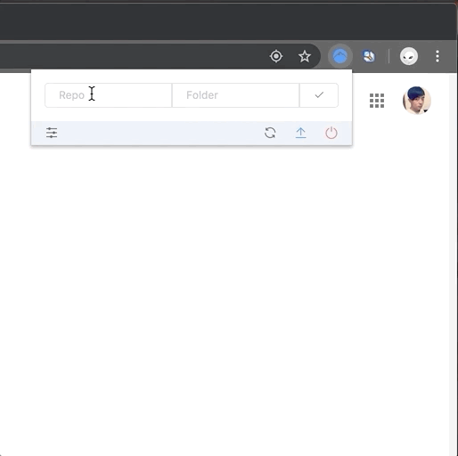

# Picee

**Picee** is a chrome extension for people to use Github as their image hosting service.

## Installation
1. Go to [chrome://extensions](chrome://extensions).
2. Turn on "Development mode" on the top right.
3. Drag [picee.crx](./release/picee.crx) into the page.
4. Done.

## Usage

Before using **Picee**, you should make authentication with Github. **Picee** supports both *Github oAuth token* and *Github account and password*.

> **Picee** uses the token or account & password only for requesting Github apis, will never send to any other places.

After authentication, type the repo name and folder path, then click the check button.

> Repo name must be like **Username/Reponame**. Folder path could be blank, default to the repo's root.

You can select, paste or drag an image to the dashed area, then click the upload button (or set autoupload from the configuration). Once upload successed, the download url would be placed in the output area.

Enjoy!

## Lisence
[MIT](./LICENSE)